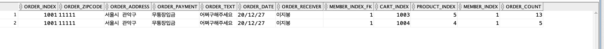

# 장바구니와 주문을 연결하는 것에 관련된 md
## 1. 테이블 및 시퀀스 생성
```sql
CREATE TABLE cs_order(
    order_index NUMBER PRIMARY KEY,
    order_zipcode char(5) not null,
    order_address varchar2(128) not null,
    order_payment varchar2(20) not null,
    order_text varchar2(1000),
    order_date DATE default sysdate not null,
    order_receiver VARCHAR2(128) NOT NULL,
    member_index_fk NUMBER,
    FOREIGN KEY(member_index_fk) REFERENCES cs_member(member_index)
);

CREATE SEQUENCE seq_order_index
START WITH 1001
INCREMENT BY 1;

CREATE TABLE cs_cart(
    cart_index NUMBER PRIMARY KEY,
    product_index NUMBER,
    member_index NUMBER,
    order_count NUMBER,
    FOREIGN KEY(product_index) REFERENCES cs_product(product_index),
    FOREIGN KEY(member_index) REFERENCES cs_member(member_index)
    
);

CREATE SEQUENCE seq_cart_index
START WITH 1001
INCREMENT BY 1;

```
start 값 수정 필요

- 처음에는 단순하게 장바구니 테이블의 데이터가 오더 테이블로 넘어간다고 생각해서 장바구니 index를 오더 테이블의 fk로 줬었는데, 그렇게 하니 오류 발생.
- `회원`이 `장바구니`에 물건을 넣고 그 회원이 그 물건을 `주문`하고 결제하므로, 회원 번호를 두 테이블의 FK로 설정하여 JOIN하는 것이 맞다고 판단.
## 2. 가데이터 삽입
```sql
INSERT INTO cs_cart VALUES(
    seq_cart_index.nextval,
    4,
    1,
    5
);

INSERT INTO cs_cart VALUES(
    seq_cart_index.nextval,
    5,
    1,
    13
);

INSERT INTO cs_order VALUES(
    seq_order_index.nextval,
    '11111',
    '서울시 관악구',
    '무통장입금',
    '어쩌구해주세요',
    default,
    '이지봉',
    1
);
```

## 3. JOIN 쿼리문
```sql
SELECT * FROM cs_order o 
JOIN cs_cart c 
ON o.member_index_fk=c.member_index;
```

## 4. 결과



